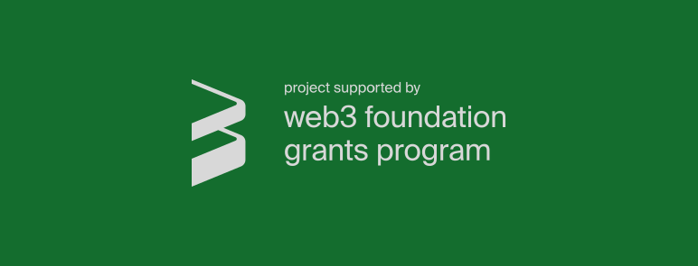

# WeTEE

WeTEE is a decentralized application deployment platform integrated with a Trusted Execution Environment (TEE).

WeTEE consists of blockchain networks and multiple confidential computing clusters, collectively providing an efficient decentralised solution for confidential computing.

This project is funded by [Web3 Foundation](https://web3.foundation) via their [Open Grants Program](https://github.com/w3f/Open-Grants-Program)

## Architecture

All business logic has been migrated to smart contracts: [https://github.com/wetee-dao/contract](https://github.com/wetee-dao/contract)

