# Milestone 1 Documentation

## 1. Use Worker Module

### 1.1. Cluster Registration

- Open Polkadot JS UI

- Connect to `development node` --> `local node`

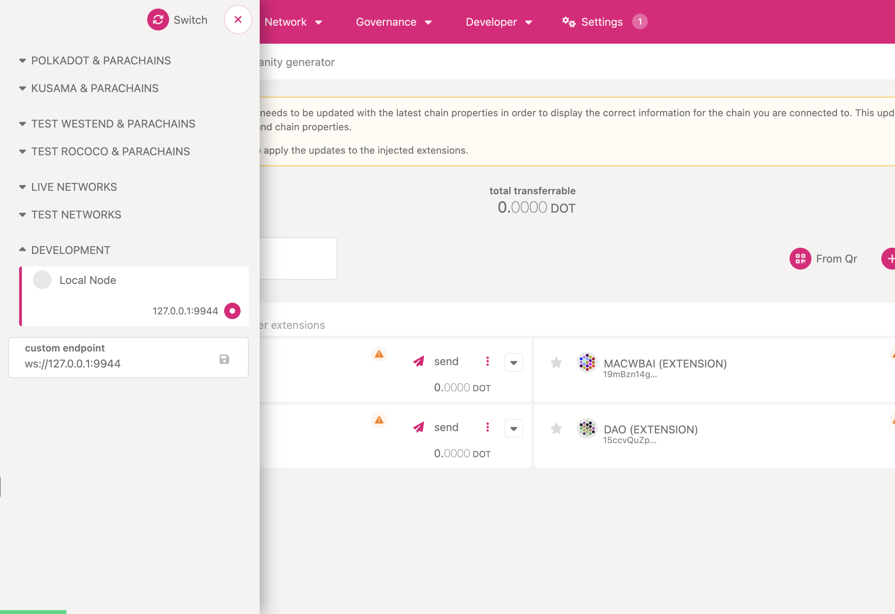

- Open `Developer` --> `Extrinsics` section

- From the list of available extrinsics select `weteeWorker` --> `clusterRegister` callable

    **IPv4 `127.0.0.1` format to u32 is `2130706433`**  

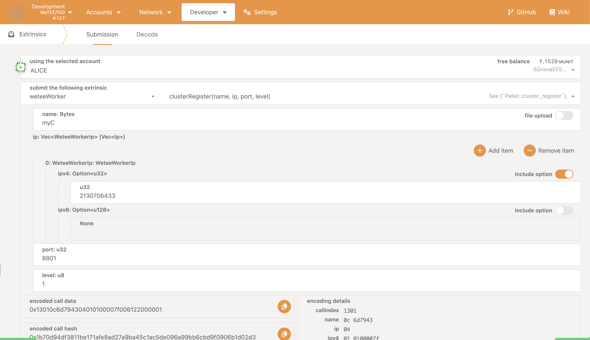

- Submit `Transaction` --> `Cluster` successfully registered

### 1.2. Start Service with a Mortgage

- Go to `Developer` --> `Extrinsics` section

- Select `weteeWorker` --> `clusterMortgage` callable

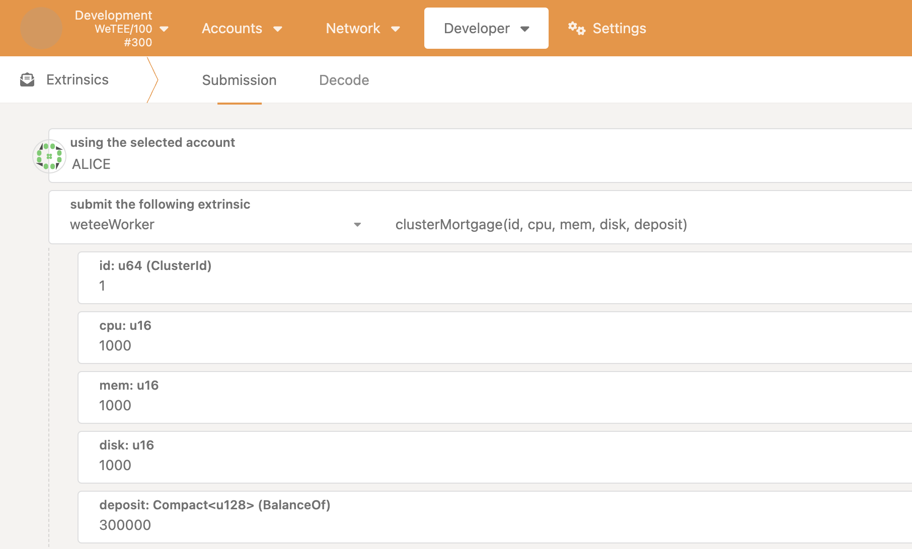

- Submit `Transaction` --> `Cluster` successfully started

    To facilitate the testing of unmortgage operation below, we recommend performing **multiple mortgage operations**.  

### 1.3. Unlock Unused Mortgage

**Optional step, if unmortgage is performed here, the subsequent steps need to be carried out, and the mortgage operation mentioned earlier needs to be repeated.**  

- Go to `Developer` --> `Chain State`

- Select `weteeWorker` --> `deposits` for state query and press `+` button

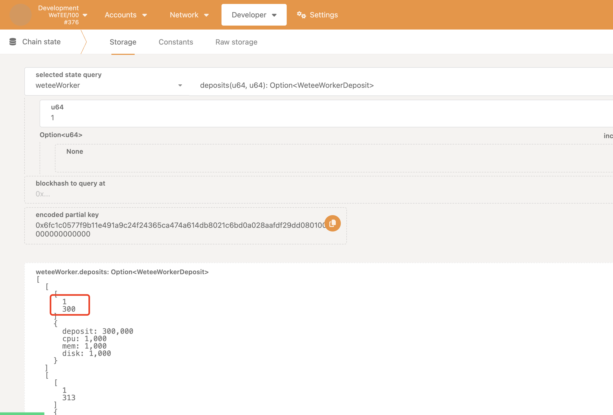

- Get id and block number of the mortgage you want to unlock（ The value marked by the red frame in the above picture ）

- Go to `Developer` --> `Extrinsics` section

- Select `weteeWorker` --> `clusterUnmortgage` callable

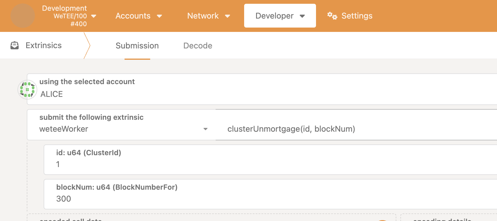

- Submit `Transaction`

### 1.4. SGX Key

Cluster uploads the SGX public key, proving that the entire control panel is operating in a secure and trusted environment.  

- Go to `Developer` --> `Extrinsics` section

- Select `weteeWorker` --> `clusterProofUpload` callable

- Input the public key of the worker node

    ```bash
    -----BEGIN PUBLIC KEY-----
    MIIBoDANBgkqhkiG9w0BAQEFAAOCAY0AMIIBiAKCAYEA1kLvg9+V+G4iY64VJHGZ
    Ns3Pk8e64MWN+1SDYvFkruYYdCDPDnDiQyYjH0mD+XCVlLp0xm2Zfg1lFRMsUm9n
    NewAdX1wwJD9OXiDeGLj2j9bTGorCCuUBihkS0XvH6EfLJAeDXtR+Ks4bT+JqyCY
    AHkAzGe1c63SLPIkPIX5iOpls3kQrWjswedk/LU1G8cmDvkD8pZBim+FZcu2FNOg
    2ISQJFItcQUhl7k3aEvU+JIMOrLUSfFfldEZxSgAUNc6R7EDPL2AFJkCUDHIMO78
    YlpbaZGa9D7/zA8hMk2LI7mOAZ30NY5jp0bze91Df6zJ+BM85cMgM5bY+RwlL6iI
    AaBSThDrtr7XrVOhjntlk4CDNakmG9QbL9zZdJ8ufIrC0ol299CNq0xs1/BF6z74
    djfP0wPkD0UjN0GBcjOF7T3ARgQdvohNp1W34pbLeOmJ+Py8Ha4FsVkB4Dyudwz+
    5HOzL1C1i1fIrwADUHvKjuIFdJB70FaYrxlozhn9hl7bAgED
    -----END PUBLIC KEY-----
    ```

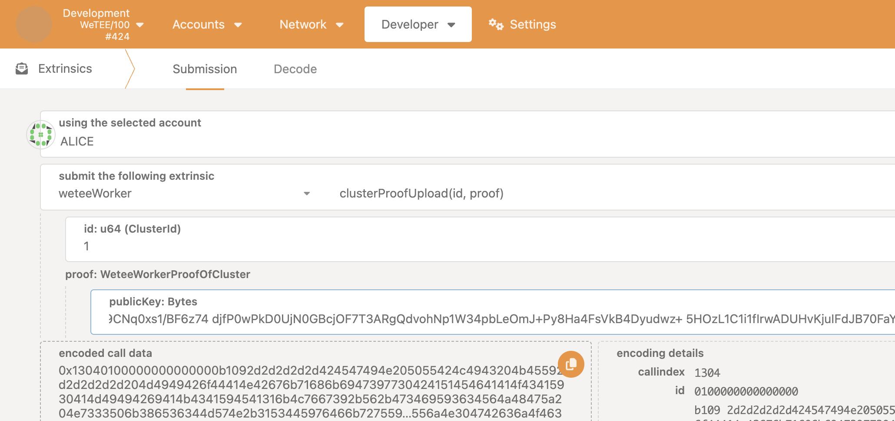

- Submit `Transaction`

### 1.5. Submit TEE Test Program

- Go to `Developer` --> `Extrinsics` section

- Select `weteeApp` --> `create` callable

- Fill in the form

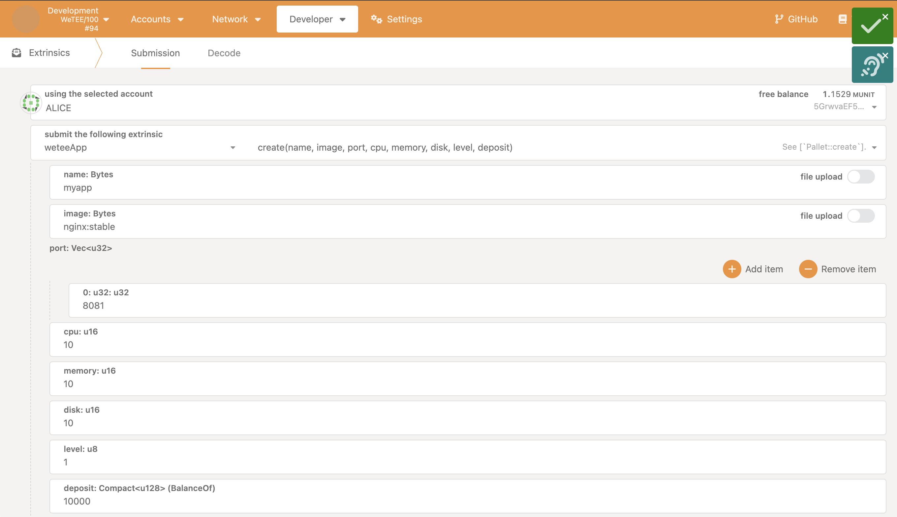

- Click `Submit Transaction`

### 1.6. Check App Status and Generate Tokens

- Go to `Developer` --> `Chain State`

- Select `weteeWorker` --> `workContractState` for state query input workId

- App ID => `id=0` and type => `wtype=APP` , press `+` button

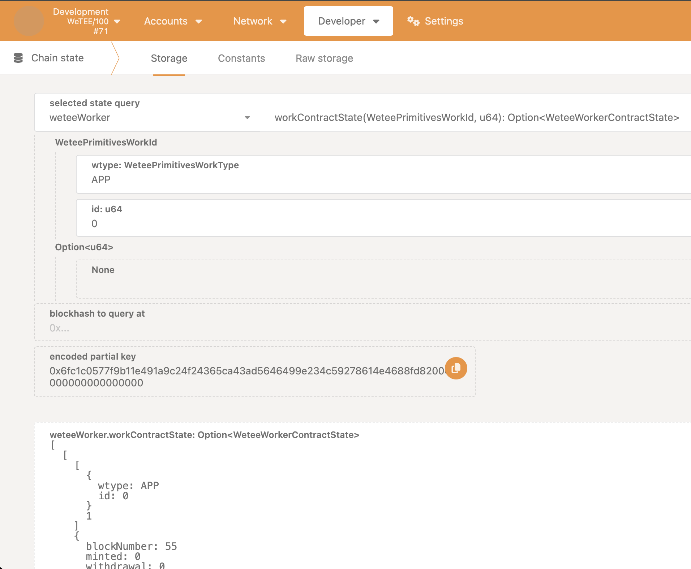

- Go to `Developer` --> `Extrinsics` section

- Select `weteeWorker` --> `workProofUpload` callable

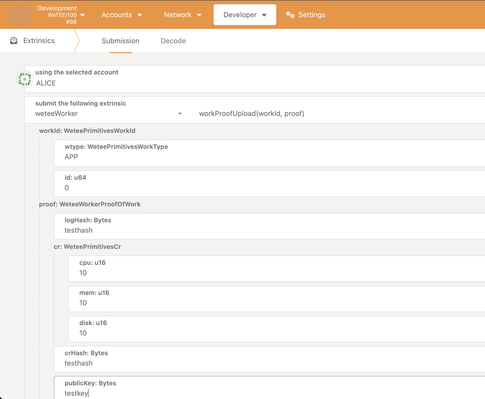

- After submit, mint state has changed

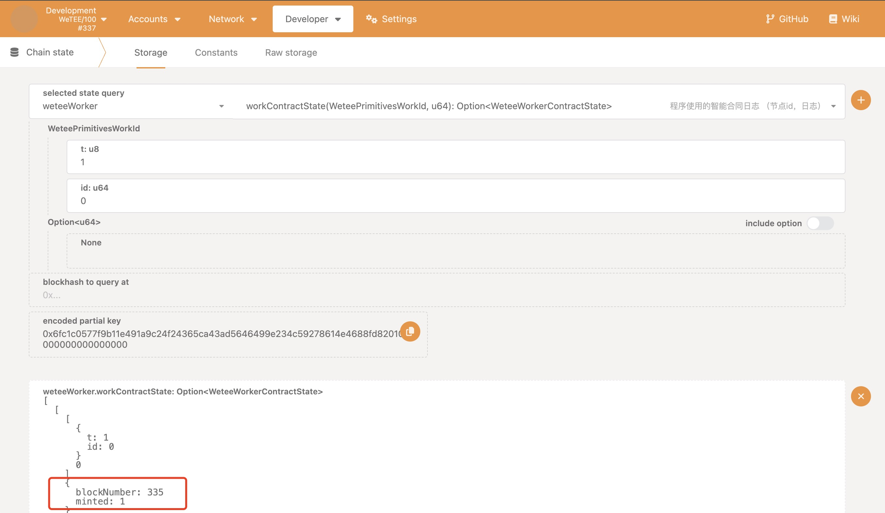

### 1.7. Withdraw Minted Tokens

- Go to `Developer` --> `Extrinsics` section

- Select `weteeWorker` --> `clusterWithdrawal` callable

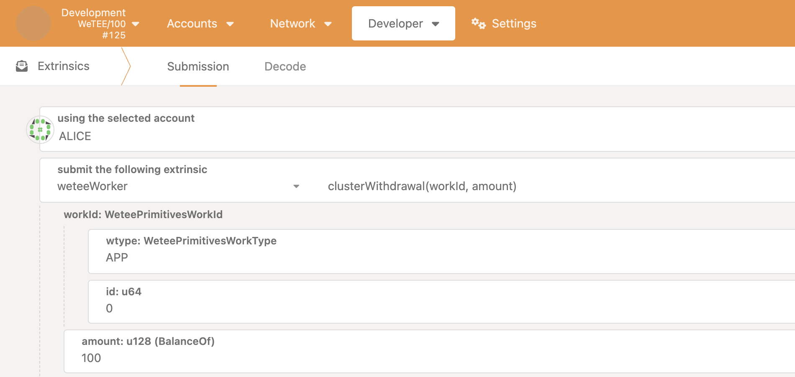

- Submit the request

### 1.8. Report a Problem as a User

- Go to `Developer` --> `Extrinsics` section

- Select `weteeWorker` --> `clusterReport` callable

- Fill in the form

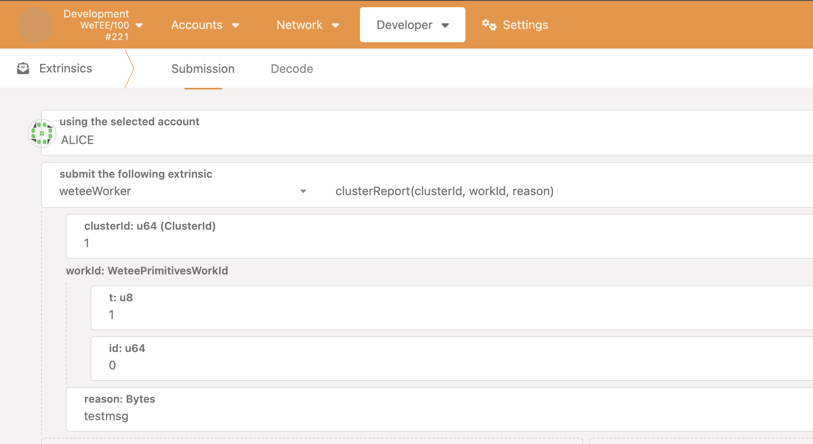

- Submit the report

- The report will be reviewed by the clu and you will receive a response

## 2. Use APP Module

### 2.1. New APP Creation

- Go to `Developer` --> `Extrinsics` section

- Select `weteeApp` --> `create` callable

- Fill in the form


- Submit the request

- The app will be running

### 2.2. APP Update

- Go to `Developer` --> `Extrinsics` section

- Select `weteeApp` --> `update` callable

- Fill in the form

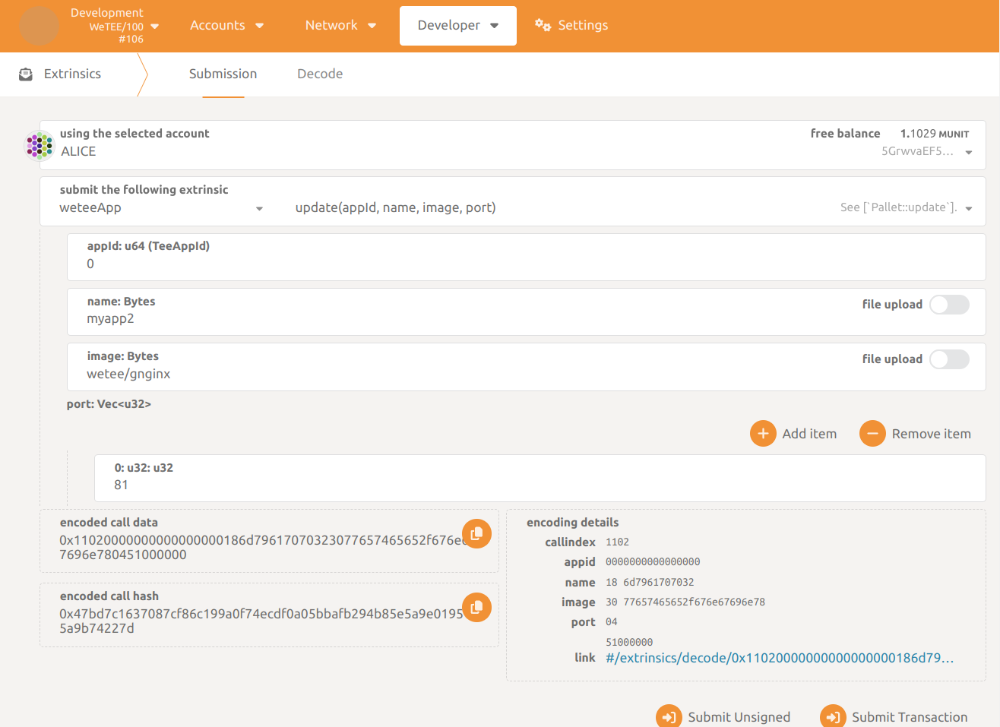

- Submit the request

- The app will be update

### 2.3. APP Settings

- Go to `Developer` --> `Extrinsics` section

- Select `weteeApp` --> `setSettings`

- Fill in the form

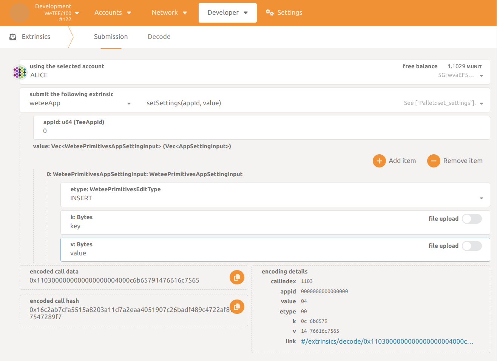

- Submit the request

- The app will be set settings to app run environment

### 2.4. APP Recharge

- Go to `Developer` --> `Extrinsics` section

- Select `weteeApp` --> `recharge`

- Fill in the form

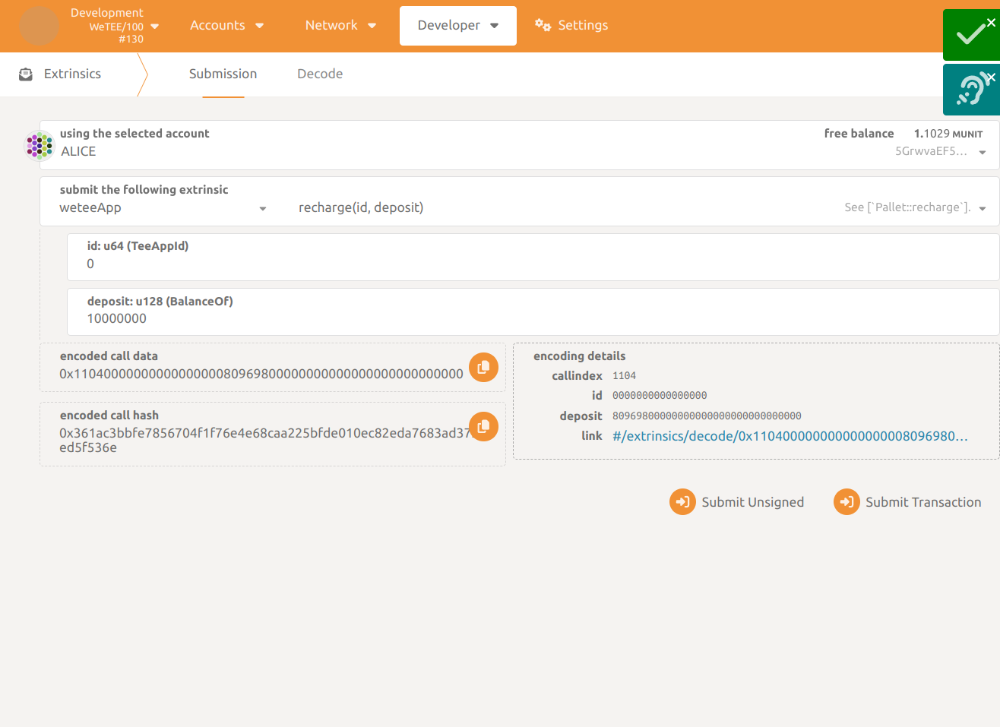

- Submit the request

- The app will be charged

### 2.5. APP Stop

- Go to `Developer` --> `Extrinsics` section

- Select `weteeApp` --> `stop`

- Fill in the form

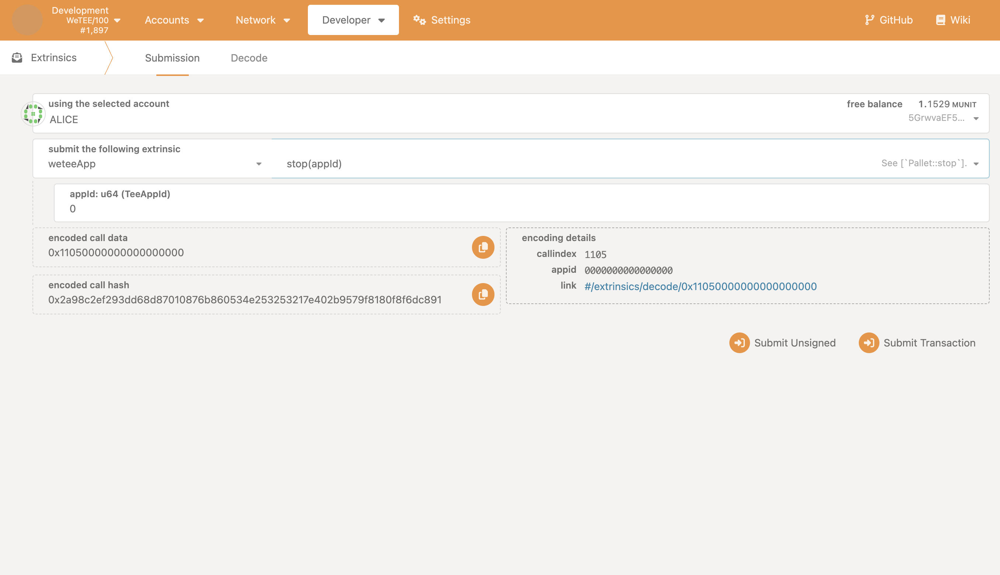

- Submit the request

- The app will be stop

## 3. Use Task Module

### 3.1. New Task Creation

- Go to `Developer` --> `Extrinsics` section

- Select `weteeTask` --> `create` callable

- Fill in the form

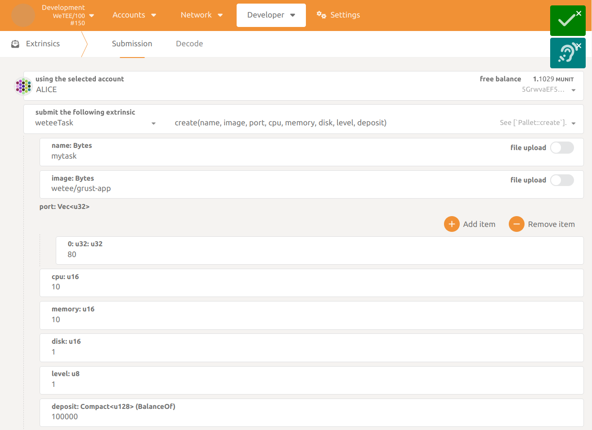

- Submit the request

- The task will be running

### 3.2. Task Update

- Go to `Developer` --> `Extrinsics` section

- Select `weteeTask` --> `update` callable

- Fill in the form

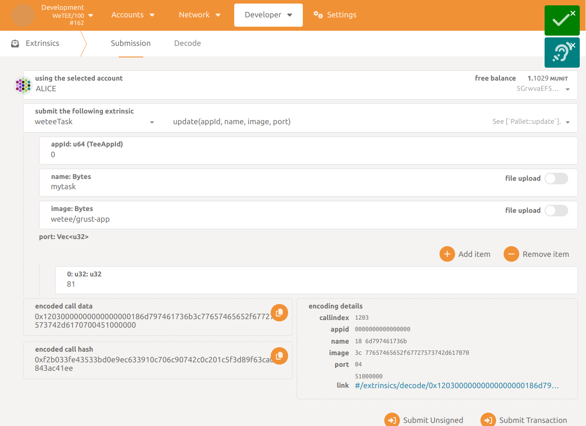

- Submit the request

- The task will be update

### 3.3. Task Settings

- Go to `Developer` --> `Extrinsics` section

- Select `weteeTask` --> `setSettings`

- Fill in the form

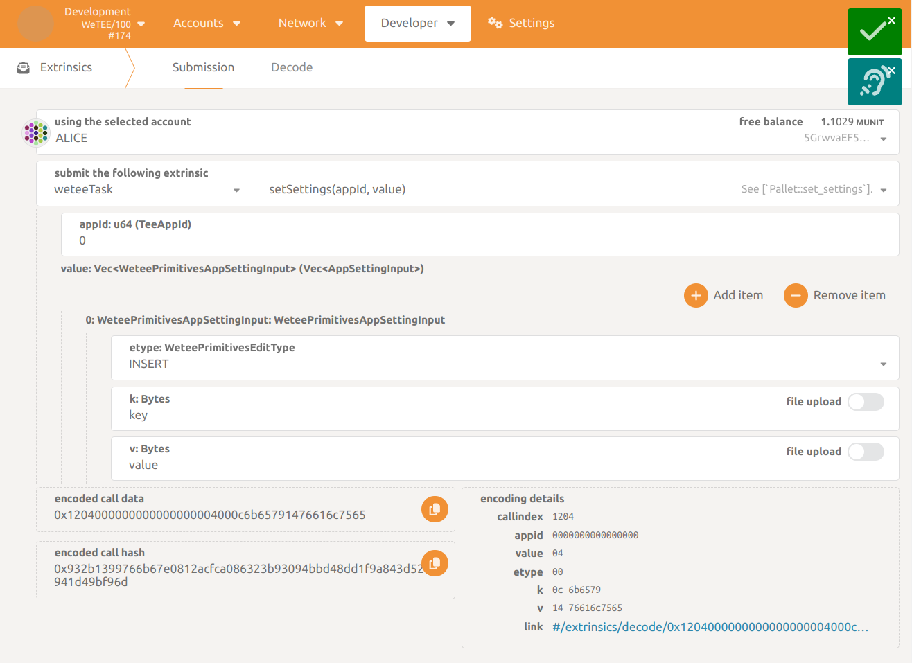

- Submit the request

- The task will be set settings to app run environment

### 3.4. Task Recharge

- Go to `Developer` --> `Extrinsics` section

- Select `weteeTask` --> `recharge`

- Fill in the form

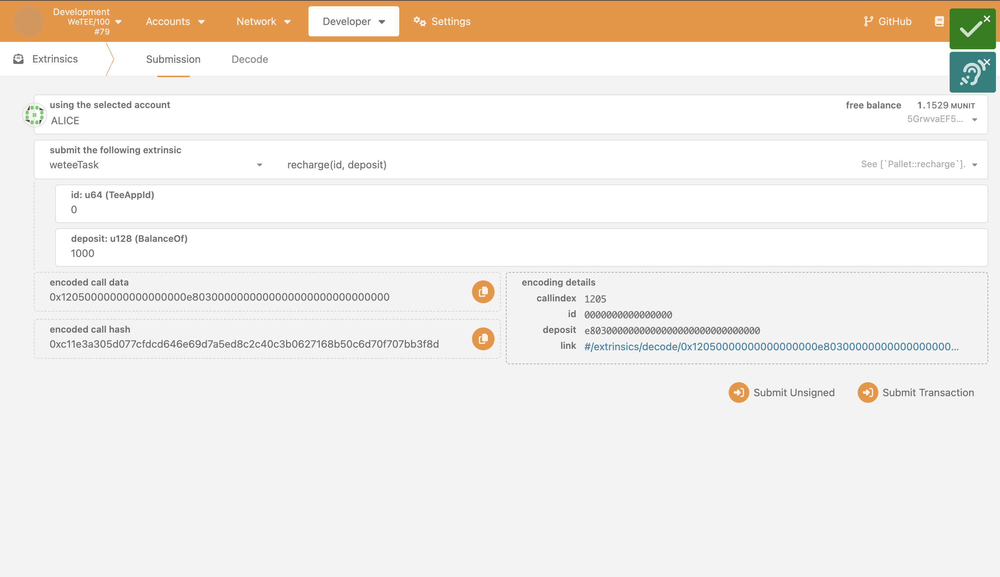

- Submit the request

- The task will be charged

### 3.5. Task Stop

- Go to `Developer` --> `Extrinsics` section

- Select `weteeTask` --> `stop`

- Fill in the form


- Submit the request

- The task will be stop

### 3.6. Task Rerun

- Go to `Developer` --> `Extrinsics` section

- Select `weteeTask` --> `rerun`

- Fill in the form


- Submit the request

- The task will be run one more time

