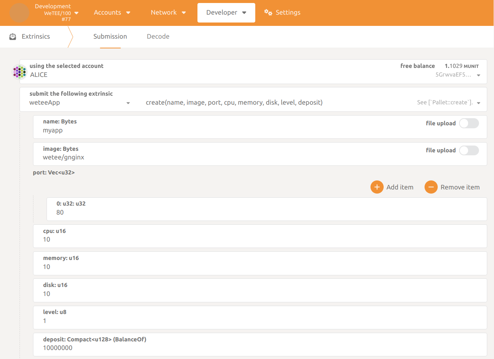
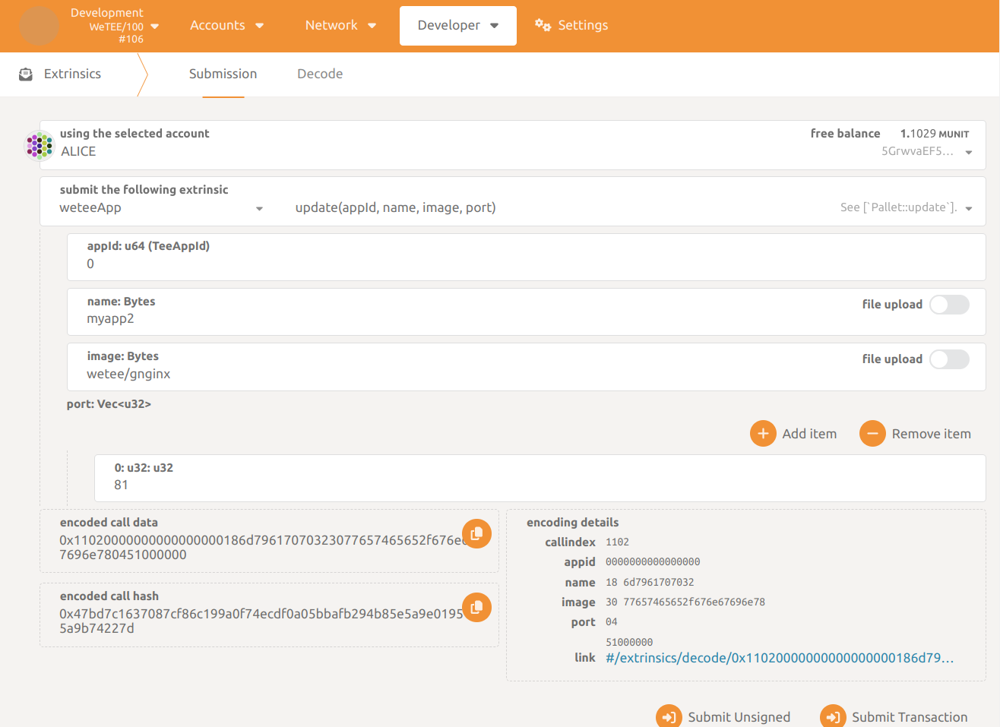
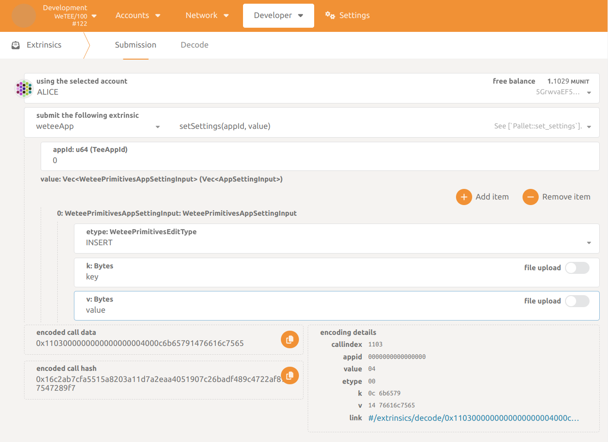
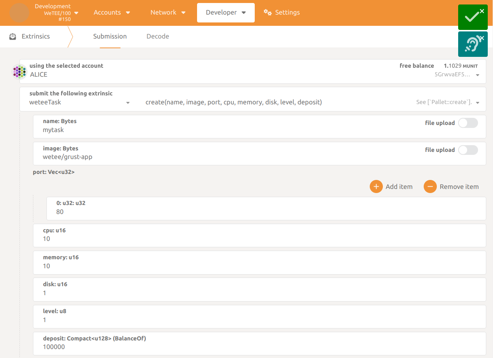
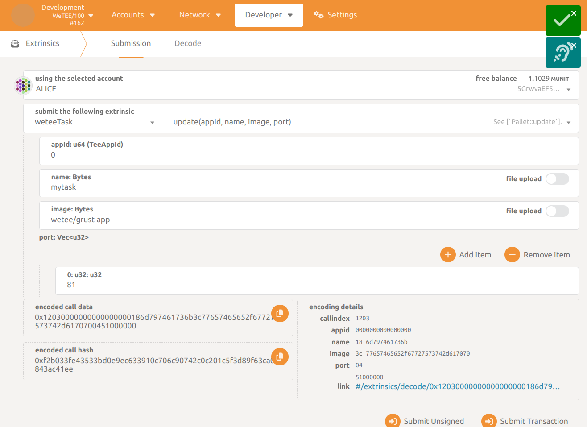

# Milestone 2 Documentation

## Hardware and Software Requirements
- [CPU List - click to see cpu list](https://ark.intel.com/content/www/us/en/ark/search/featurefilter.html?productType=873&2_SoftwareGuardExtensions=Yes%20with%20Intel%C2%AE%20ME)
    - Intel 7th generation (Kaby Lake) Core i3, i5, i7, and i9 processors
    - Intel 8th generation (Cannon Lake) Core i3, i5, i7, and i9 processors
    - Intel 9th generation (Cascade Lake) Core i3, i5, i7, and i9 processors
    - Intel 10th generation (Comet Lake) Core i3, i5, i7, and i9 processors
    - 2nd Generation Xeon Scalable processors (Cascade Lake) and later generations generally provide SGX capabilities.
- OS ubuntu 20.04 or ubuntu 22.04 (not in docker)

## Setup local enviroment

### Intel Sgx Setup on Ubuntu 20.04/Ubuntu 22.04 and Ego Setup
> For more information about Ego, please refer to https://docs.edgeless.systems/ego/getting-started/install
```bash
sudo apt install build-essential libssl-dev

sudo mkdir -p /etc/apt/keyrings
wget -qO- https://download.01.org/intel-sgx/sgx_repo/ubuntu/intel-sgx-deb.key | sudo tee /etc/apt/keyrings/intel-sgx-keyring.asc > /dev/null
echo "deb [signed-by=/etc/apt/keyrings/intel-sgx-keyring.asc arch=amd64] https://download.01.org/intel-sgx/sgx_repo/ubuntu $(lsb_release -cs) main" | sudo tee /etc/apt/sources.list.d/intel-sgx.list
sudo apt update

EGO_DEB=ego_1.4.1_amd64_ubuntu-$(lsb_release -rs).deb
wget https://github.com/edgelesssys/ego/releases/download/v1.4.1/$EGO_DEB
sudo apt install ./$EGO_DEB build-essential libssl-dev

sudo mkdir /opt/wetee-worker
sudo chmod 777 /opt/wetee-worker
```

### K3s Setup
> For more information about K3s, please refer to https://docs.k3s.io/quick-start
```bash
curl -sfL https://get.k3s.io | sh -
``` 

### Start local test chain
```bash
docker run -p 9944:9944 --name wetee wetee/wetee-node:dev.2024-02-03-22_03
```

## Link to test chain and cluster
```bash
git clone  https://github.com/wetee-dao/worker && cd worker

# 1.1 Setup SGX
sh hack/sgx_device.sh

# 1.2 Install CRD
make install

# 1.3 run local worker or docker worker

sh hack/dev.sh

# OR

docker run --device /dev/sgx/enclave --device /dev/sgx/provision \        
     --network host \
     -e KUBECONFIG=/etc/kube/config \
     -v /etc/rancher/k3s:/etc/rancher/k3s \
     wetee/worker:dev
```


## 1. Use as cluster to mint

### 1.1. Cluster root user bind and login 

- Open Polkadot JS UI

- Connect to `development node` --> `local node`


- Open `Developer` --> `Sign and verify` section

- At account list select `ALICE` callable

- Input awaiting signature data 
```
{"address":"5GrwvaEF5zXb26Fz9rcQpDWS57CtERHpNehXCPcNoHGKutQY","timestamp":1706250781}
```


- Submit `Sign message` successfully signed message

- Open cluster worker address `http://127.0.0.1:8880/`
- Input data and signature like this
  ```
  mutation{
    loginAndBindRoot(
      input: {address:"5GrwvaEF5zXb26Fz9rcQpDWS57CtERHpNehXCPcNoHGKutQY",timestamp:1706250781}, 
      signature: "0x00c4ba3a5e02c0ddb8396a2019aba79266e37554922f2995847d7a9067d5f87d7b3c9d90fde34137781086461bc43f2f17d97918174fd9142bc094c05f06cf8e")
  }
  ```
- Click `Execute` button and check result has no error
  ```json
  {
    "data": {
      "loginAndBindRoot": "0x7b2261646472657373223a223547727776614546357a58623236467a397263517044575335374374455248704e6568584350634e6f48474b75745159222c2274696d657374616d70223a313730363235303738312c226973526f6f74223a66616c73657d||0x00c4ba3a5e02c0ddb8396a2019aba79266e37554922f2995847d7a9067d5f87d7b3c9d90fde34137781086461bc43f2f17d97918174fd9142bc094c05f06cf8e"
    }
  }
  ```
  

### 1.2 Check cluster worker address and send token to cluster worker address
- Open cluster worker address `http://127.0.0.1:8880/`
- Input data like this
  ```
  {
    workerInfo{
      RootAddress
      MintAddress
    }
  }
  ```
- Click `Execute` button and check result has no error
  ```json
  {
    "data": {
      "workerInfo": {
        "RootAddress": "5GrwvaEF5zXb26Fz9rcQpDWS57CtERHpNehXCPcNoHGKutQY",
        "MintAddress": "{MintAddress}"
      }
    }
  }
  ```
  
- Open Polkadot JS UI
- Open `Accounts` --> `Transfer` section
- Input `{MintAddress}` to `send to address` 
- Input `100000` to `amount`
- Click `Transfer` button and check result has no error

### 1.3 Register cluster to chain
- Open cluster worker address `http://127.0.0.1:8880/`
- Input data like this
  ```
  mutation{
    cluster_register(
      name:"test",
      ip: "127.0.0.1",
      port: 8880
      level: 1
    )
  }
  ```

- Input Header data (1.1 loginAndBindRoot result) in `Authorization` like this
  ```json 
  {
    "Authorization": "0x7b2261646472657373223a223547727776614546357a58623236467a397263517044575335374374455248704e6568584350634e6f48474b75745159222c2274696d657374616d70223a313730363235303738312c226973526f6f74223a66616c73657d||0x00c4ba3a5e02c0ddb8396a2019aba79266e37554922f2995847d7a9067d5f87d7b3c9d90fde34137781086461bc43f2f17d97918174fd9142bc094c05f06cf8e"
  }
  ```

- Click `Execute` button and check result has no error
  ```json
  {
    "data": {
      "cluster_register": "ok"
    }
  }
  ```
  

### 1.4 Cluster mortgage hardware to start minting
- Open cluster worker address `http://127.0.0.1:8880/`
- Input data like this
  ```
  mutation{
    cluster_mortgage(
      cpu: 100,
      mem: 100,
      disk: 100,
      deposit: 10000
    )
  }
  ```

- Input Header data (1.1 loginAndBindRoot result) in `Authorization` like this
  ```json 
  {
    "Authorization": "0x7b2261646472657373223a223547727776614546357a58623236467a397263517044575335374374455248704e6568584350634e6f48474b75745159222c2274696d657374616d70223a313730363235303738312c226973526f6f74223a66616c73657d||0x00c4ba3a5e02c0ddb8396a2019aba79266e37554922f2995847d7a9067d5f87d7b3c9d90fde34137781086461bc43f2f17d97918174fd9142bc094c05f06cf8e"
  }
  ```

- Input Header data (1.1 loginAndBindRoot result) in `Authorization` like this
  ```json 
  {
    "Authorization": "0x7b2261646472657373223a223547727776614546357a58623236467a397263517044575335374374455248704e6568584350634e6f48474b75745159222c2274696d657374616d70223a313730363235303738312c226973526f6f74223a66616c73657d||0x00c4ba3a5e02c0ddb8396a2019aba79266e37554922f2995847d7a9067d5f87d7b3c9d90fde34137781086461bc43f2f17d97918174fd9142bc094c05f06cf8e"
  }
  ```

- Click `Execute` button and check result has no error
  ```json
  {
    "data": {
      "cluster_mortgage": "ok"
    }
  }
  ```
   
  
### 1.5 Cluster withdrawal（Since mining activity has not yet occurred, it is necessary to first execute steps 2. Use as app developer and 3. Use as task developer before proceeding.）
- Open cluster worker address `http://127.0.0.1:8880/`
- Input data like this
  ```
  mutation{
    cluster_withdrawal(id:0,ty:APP,val:100)
  }
  ```
- Click `Execute` button and check result has no error
  ```json
  {
    "data": {
      "cluster_withdrawal": "ok"
    }
  }
  ```


## 2. Use as app developer
### 2.1. Create TEE app
- Go to `Developer` --> `Extrinsics` section

- Select `weteeApp` --> `create` callable

- Fill in the form


- Submit the request

- The app will be running
### 2.2. Update TEE app
- Go to `Developer` --> `Extrinsics` section

- Select `weteeApp` --> `update` callable

- Fill in the form


- Submit the request

- The app will be update
### 2.3. Set settiings for TEE app
- Go to `Developer` --> `Extrinsics` section

- Select `weteeApp` --> `setSettings`

- Fill in the form


- Submit the request

- The app will be set settings to app run environment
### 2.4. Restart TEE app

- Go to `Developer` --> `Extrinsics` section

- Select `weteeApp` --> `restart`

- Fill in the form


- Submit the request

- The app will be charged
### 2.5. Stop TEE app
- Go to `Developer` --> `Extrinsics` section

- Select `weteeApp` --> `stop`

- Fill in the form

- Submit the request

- The app will be stop

## 3. Use as task developer
### 3.1. Create TEE task
- Go to `Developer` --> `Extrinsics` section

- Select `weteeTask` --> `create` callable

- Fill in the form


- Submit the request

- The task will be running
### 3.2. Update TEE task
- Go to `Developer` --> `Extrinsics` section

- Select `weteeTask` --> `update` callable

- Fill in the form


- Submit the request

- The task will be update