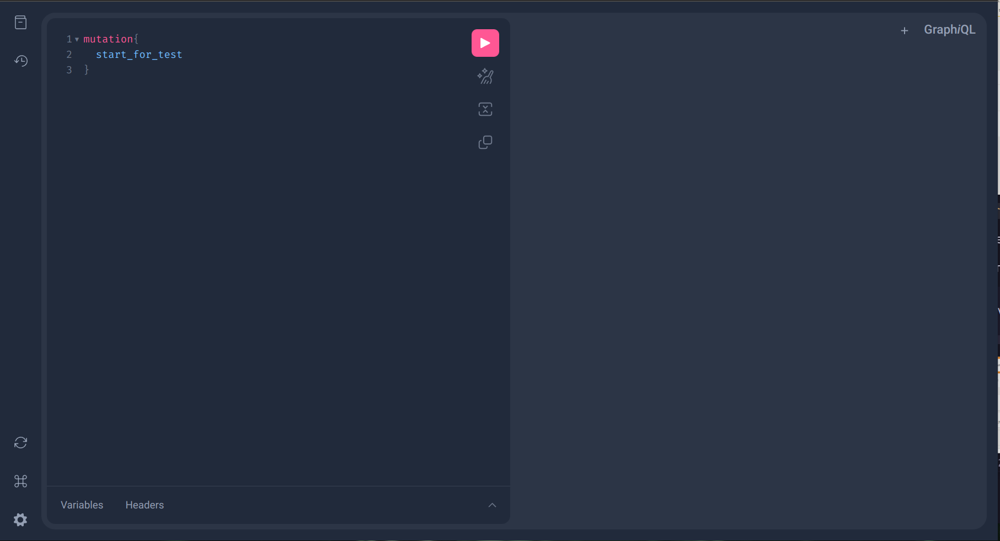
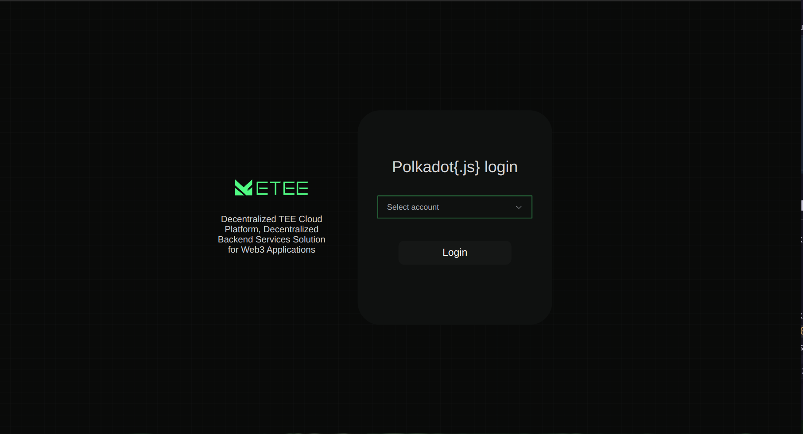
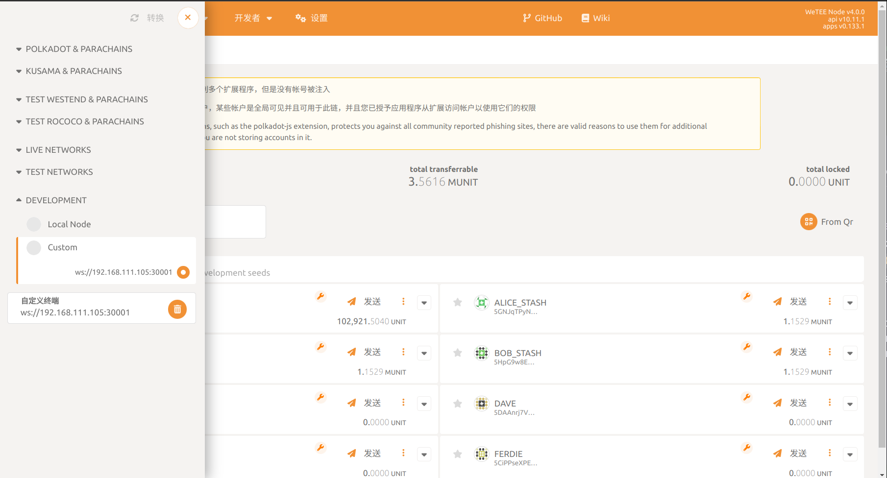
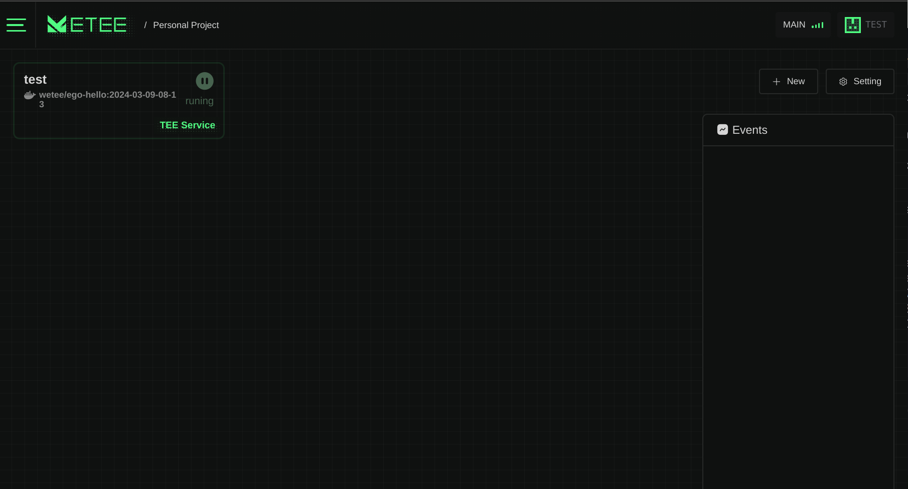
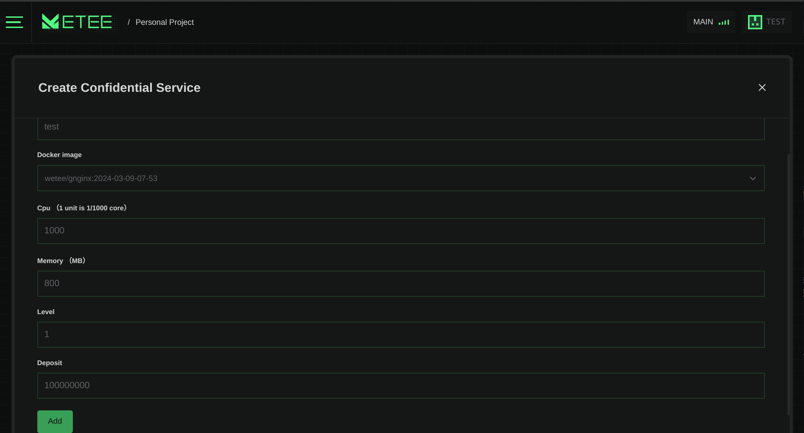
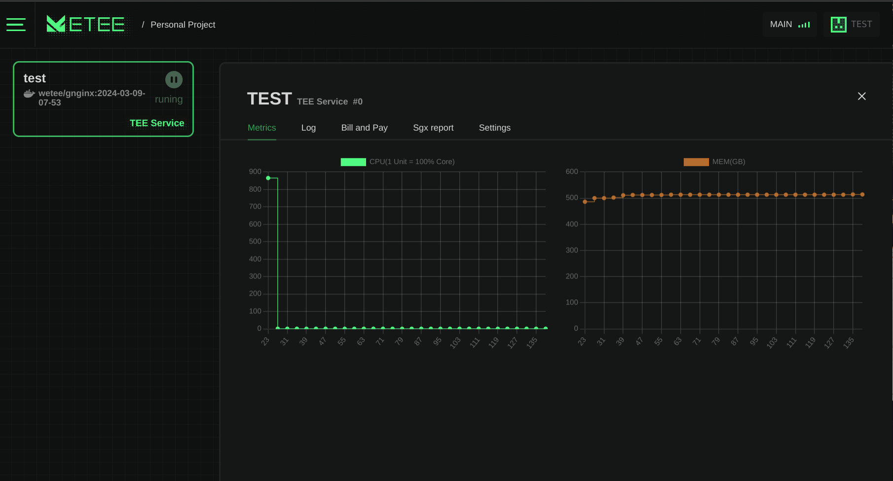
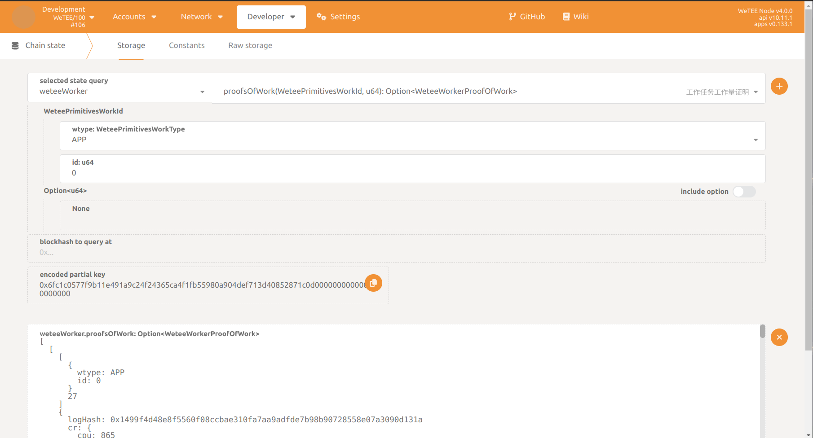
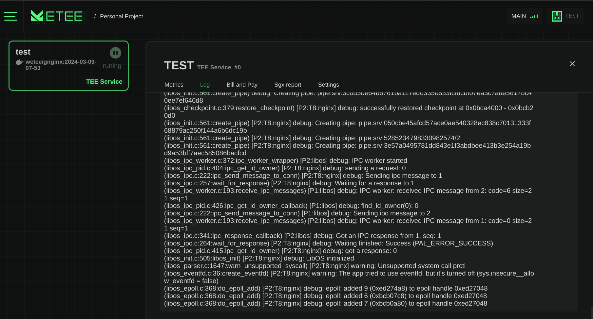
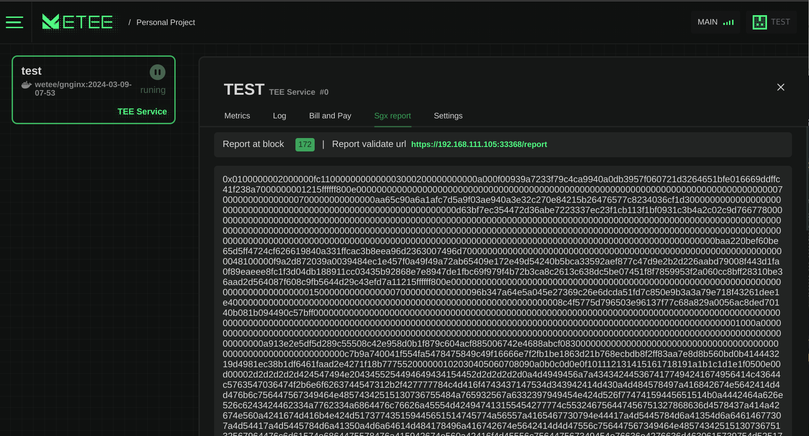
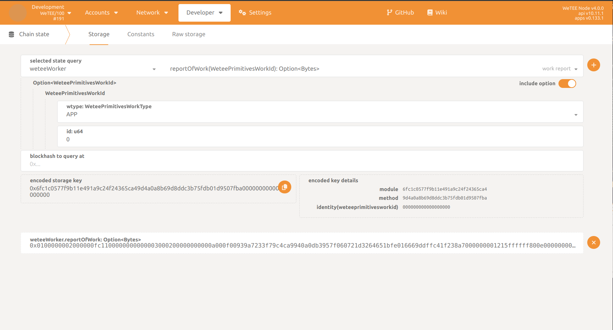

# Milestone 3 Documentation

## Hardware and Software Requirements

- [CPU List - click to see cpu list](https://ark.intel.com/content/www/us/en/ark/search/featurefilter.html?productType=873&2_SoftwareGuardExtensions=Yes%20with%20Intel%C2%AE%20ME)
  - Intel 8th generation (Cannon Lake) Core i3, i5, i7, and i9 processors
  - Intel 9th generation (Cascade Lake) Core i3, i5, i7, and i9 processors
  - Intel 10th generation (Comet Lake) Core i3, i5, i7, and i9 processors
  - 2nd Generation Xeon Scalable processors (Cascade Lake) and later generations generally provide SGX capabilities.
- Please utilize Ubuntu 20.04 or 22.04 as the HostOS, and avoid the use of containerized system.

## Setup local enviroment

### Intel Sgx Setup on Ubuntu 20.04/Ubuntu 22.04 and Ego Setup

> For more information about Ego, please refer to https://docs.edgeless.systems/ego/getting-started/install

```bash
sudo apt install build-essential libssl-dev

sudo mkdir -p /etc/apt/keyrings
wget -qO- https://download.01.org/intel-sgx/sgx_repo/ubuntu/intel-sgx-deb.key | sudo tee /etc/apt/keyrings/intel-sgx-keyring.asc > /dev/null
echo "deb [signed-by=/etc/apt/keyrings/intel-sgx-keyring.asc arch=amd64] https://download.01.org/intel-sgx/sgx_repo/ubuntu $(lsb_release -cs) main" | sudo tee /etc/apt/sources.list.d/intel-sgx.list
sudo apt update

EGO_DEB=ego_1.4.1_amd64_ubuntu-$(lsb_release -rs).deb
wget https://github.com/edgelesssys/ego/releases/download/v1.4.1/$EGO_DEB
sudo apt install ./$EGO_DEB build-essential libssl-dev

sudo mkdir /opt/wetee-worker
sudo chmod 777 /opt/wetee-worker
```

### K3s Setup

> For more information about K3s, please refer to https://docs.k3s.io/quick-start

```bash
curl -sfL https://get.k3s.io | sh -
```

### Set golang env

```bash
# Install golang 1.21 ,ubuntu 20.04 default golang version is 1.13
sudo apt install golang-1.21

# Set up the Golang environment, and/or consider adding it to the .bashrc or .zshrc file in the home directory.
export GOROOT=/usr/lib/go-1.21/
export PATH=$PATH:$GOROOT/bin
```

## Run worker images

````bash
git clone  https://github.com/wetee-dao/worker && cd worker

# 1.0 Setup Env
go mod tidy
sudo chmod 744 /etc/rancher/k3s/k3s.yaml

# 1.1 install addn docker images to k3s
sh hack/pre_install.sh

# Wait until all the images above have been installed, and use `kubectl get pod -A` to check whether sgx-device-plugin-, sgx-pccs-api-, wetee-dapp-*, and wetee-node-* have been successfully deployed.

# 1.2 and then install worker
sh hack/install.sh

# 1.3 `kubectl get pod -A` to check worker-controller-manager-* is successfully deployed.
```bash
$ kubectl get pod -A
NAMESPACE       NAME                                        READY   STATUS      RESTARTS   AGE
kube-system     local-path-provisioner-6c86858495-cr2nz     1/1     Running     0          2m22s
kube-system     coredns-6799fbcd5-pjvqk                     1/1     Running     0          2m22s
kube-system     helm-install-traefik-crd-c4vdc              0/1     Completed   0          2m23s
kube-system     helm-install-traefik-7m6xf                  0/1     Completed   1          2m23s
kube-system     sgx-device-plugin-ds-22p9v                  1/1     Running     0          118s
kube-system     svclb-traefik-17b1b422-ztq68                2/2     Running     0          118s
kube-system     metrics-server-67c658944b-29qp8             1/1     Running     0          2m22s
worker-addon    wetee-dapp-86b4cb47b8-m2f6k                 1/1     Running     0          117s
worker-addon    wetee-node-5d4bf8bc57-6rfbx                 1/1     Running     0          116s
kube-system     traefik-f4564c4f4-p8k75                     1/1     Running     0          118s
worker-addon    sgx-pccs-api-67c56bc9d5-4lkqd               1/1     Running     0          116s
worker-system   worker-controller-manager-59bccdd4c-gpt8q   2/2     Running     0          82s
````

## 1.As cluster start quick mint (The normal mining process has been validated in M2.)

- Open cluster worker address `http:// {server IP} :30000/`
- Input data
  ```
  mutation{
    start_for_test
  }
  ```
- Click `Execute` button and check result has no error
- 

## 2. Login to DAPP

- Open Dapp address `http:// {server IP} :30002/`
- Select `Account` and click `Login` button
- 

## 3 Send token to test account

- Open polkadot UI http://polkadot-ui.tc.asyou.me/#/accounts
- Connect to `development node` --> `Custom node` ->
  `ws://{server IP}:30001`
- 
- Open `Accounts` --> `Transfer` section
- Input `{MintAddress}` to `send to address`
- Input `100000` to `amount`
- Click `Transfer` button and check result has no error

### 4 Deploy an application (Confidential service)

- Open Dapp address `http://{server IP}:30002/`
- Open `Personal Project`
- 

- Click `New button` --> `Confidential Service`
- 
- Click `Add button` sign and submit to chain

### 5 Check metrics of the new service

- Click `Application card` -> click `Metrics` tab
- 
- Open polkadot UI http://polkadot-ui.tc.asyou.me
- Open `Developer` --> `Chain state` section
- Select `weteeWorker` --> `proofsOfWork` callable
- Query like this
- 
- All metrics and data hash are displayed in the `result` field

### 6 Check logs of the new service

- Click `Application card` -> click `Log` tab
- 
- Open polkadot UI http://polkadot-ui.tc.asyou.me
- Open `Developer` --> `Chain state` section
- Select `weteeWorker` --> `proofsOfWork` callable
- Query like this
- 
- All logs hash are displayed in the `result` field

### 7 Check remote attestation  of the new service

- Click `Application card` -> click `Sgx report` tab
- 
- Open polkadot UI http://polkadot-ui.tc.asyou.me
- Open `Developer` --> `Chain state` section
- Select `weteeWorker` --> `reportOfWork` callable
- Query like this
- 
- All logs hash are displayed in the `result` field
