# Node Testing Guide

## Create a DAO

- Open Polkadot JS UI

- Connect to `development node --> local node`

- Open Developer --> Extrinsics section
- From the list of available extrinsics select dao --> createDao callable 

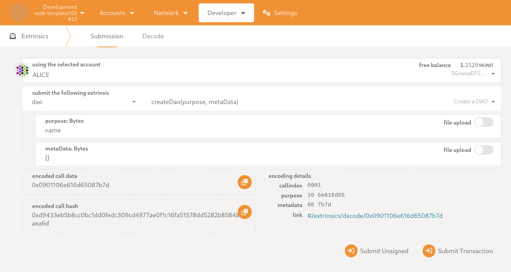

- Submit Transaction --> DAO successfully created

- Go to Developer --> Chain State

- Select dao --> daos for state query and press + button

## Create a asset for DAO
- Open Developer --> Extrinsics section
- From the list of available extrinsics select daoAsset --> createAsset callable 
- input dao id 1
- input WeteeAssetsDaoAssetMeta.name mytoken
- input WeteeAssetsDaoAssetMeta.symbol  t
- input WeteeAssetsDaoAssetMeta.decimals  100
- input amount 10000
- input initDaoAsset 1000000
- Submit Transaction --> Asset successfully created

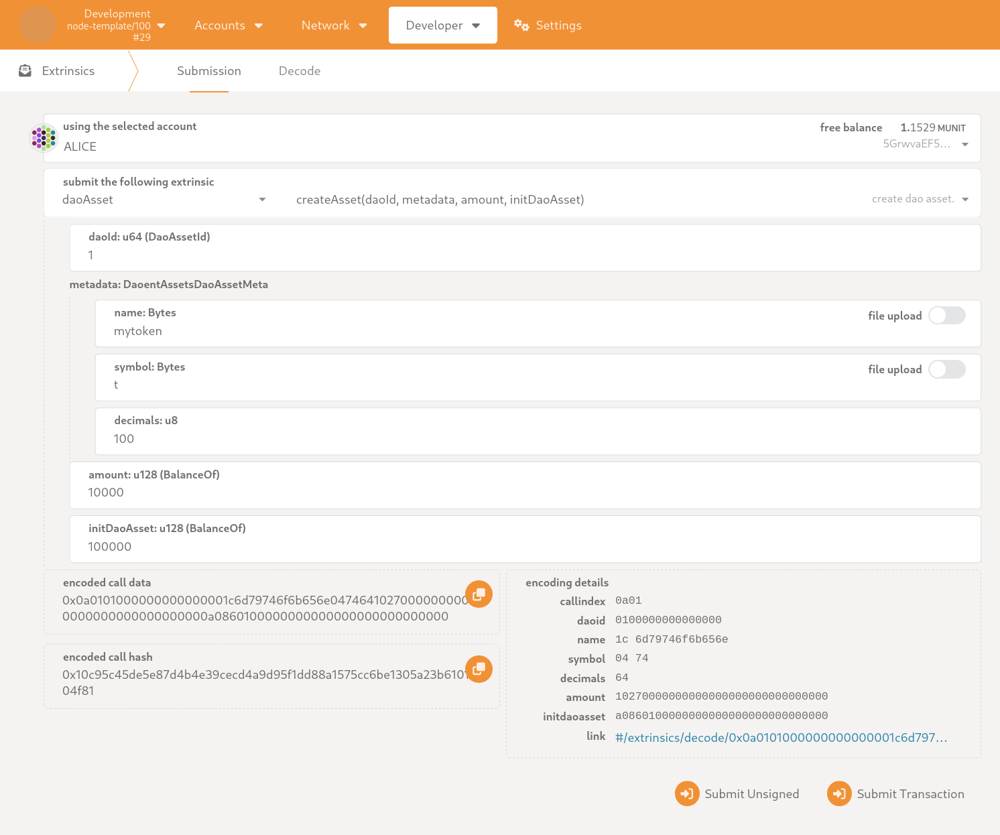

## Create a DAO guild with gov
- Open Developer --> Extrinsics section
- From the list of available extrinsics select daoGov --> createPropose callable 
- input dao id 1
- select memberData GLOBAL
- From the list of available proposal: Call (RuntimeCall) select daoGuild --> createGuild callable 
- input dao id 1
- input name and desc and metaData
- Submit Transaction --> guild propose successfully created，after the DAO is approved by an internal vote, it can be created

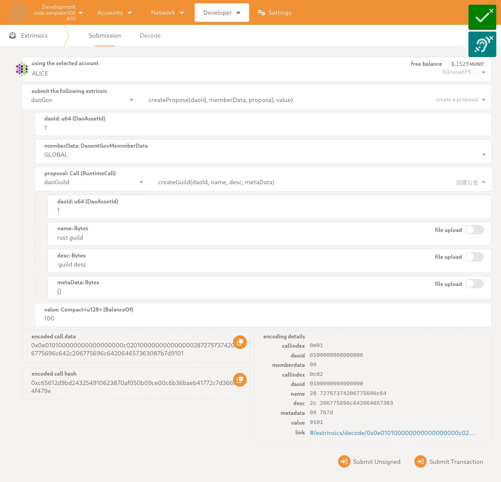

## Create a DAO project with gov
- Open Developer --> Extrinsics section
- From the list of available extrinsics select daoGov --> createPropose callable 
- input dao id 1
- select memberData GLOBAL
- From the list of available proposal: Call (RuntimeCall) select daoGuild --> createGuild callable 
- input dao id 1
- input name and desc and metaData creator
- Submit Transaction --> project propose successfully created, after the DAO is approved by an internal vote, it can be created

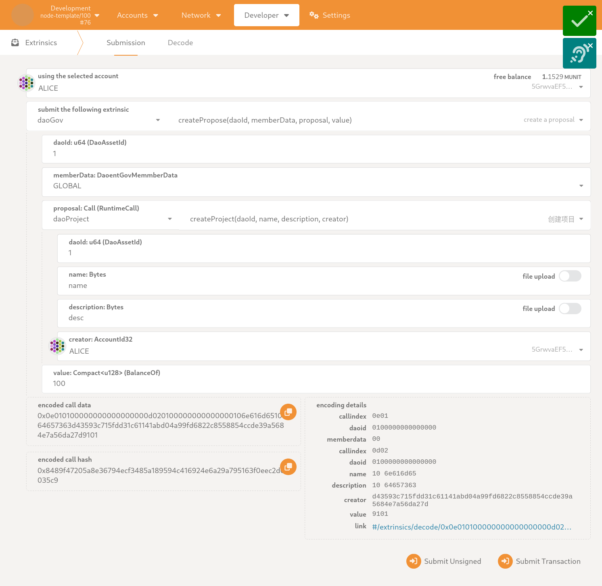

## Create a DAO guild with sudo
- Open Developer --> Extrinsics section
- From the list of available extrinsics select daoSudo --> sudo callable 
- input dao id 1
- From the list of available proposal: Call (RuntimeCall) select daoGuild --> createGuild callable 
- input dao id 1
- input name and desc and metaData
- Submit Transaction --> guild successfully created

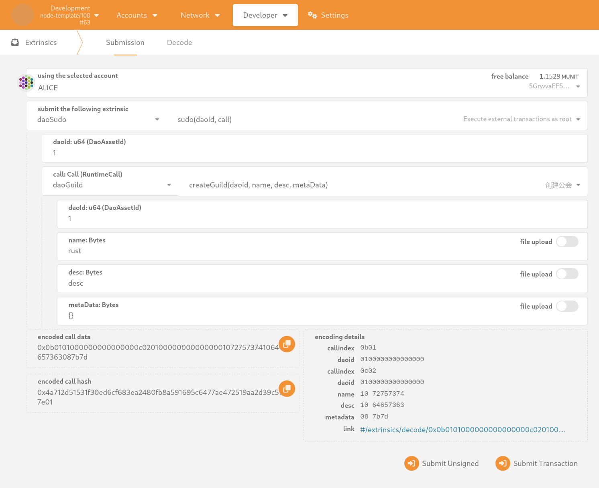

## Create a DAO project with sudo
> creator is the init project user
- Open Developer --> Extrinsics section
- From the list of available extrinsics select daoSudo --> sudo callable 
- input dao id 1
- From the list of available proposal: Call (RuntimeCall) select daoGuild --> createGuild callable 
- input dao id 1
- input name and desc and metaData creator
- Submit Transaction --> project successfully created

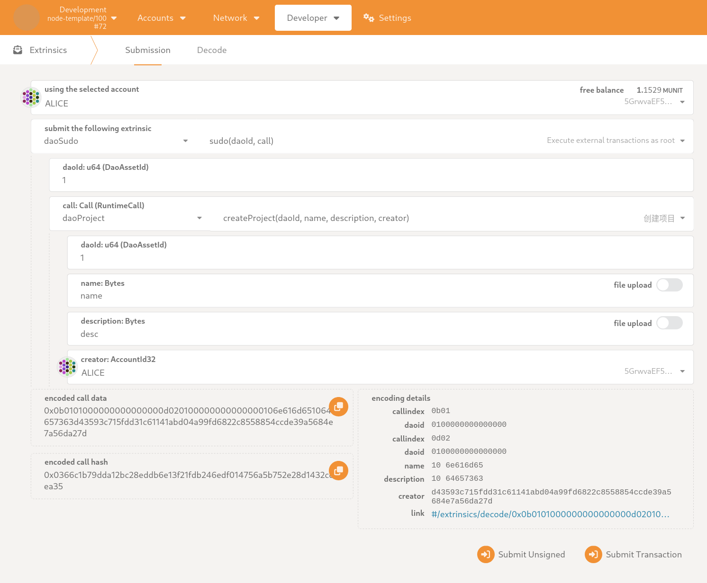

## Apply fund for project with sudo
- Open Developer --> Extrinsics section
- From the list of available extrinsics select daoSudo --> sudo callable 
- input dao id 1
- From the list of available proposal: Call (RuntimeCall) select daoGuild --> applyProjectFunds callable 
- input dao id 1
- input project id 1
- input amount
- Submit Transaction --> project will get token

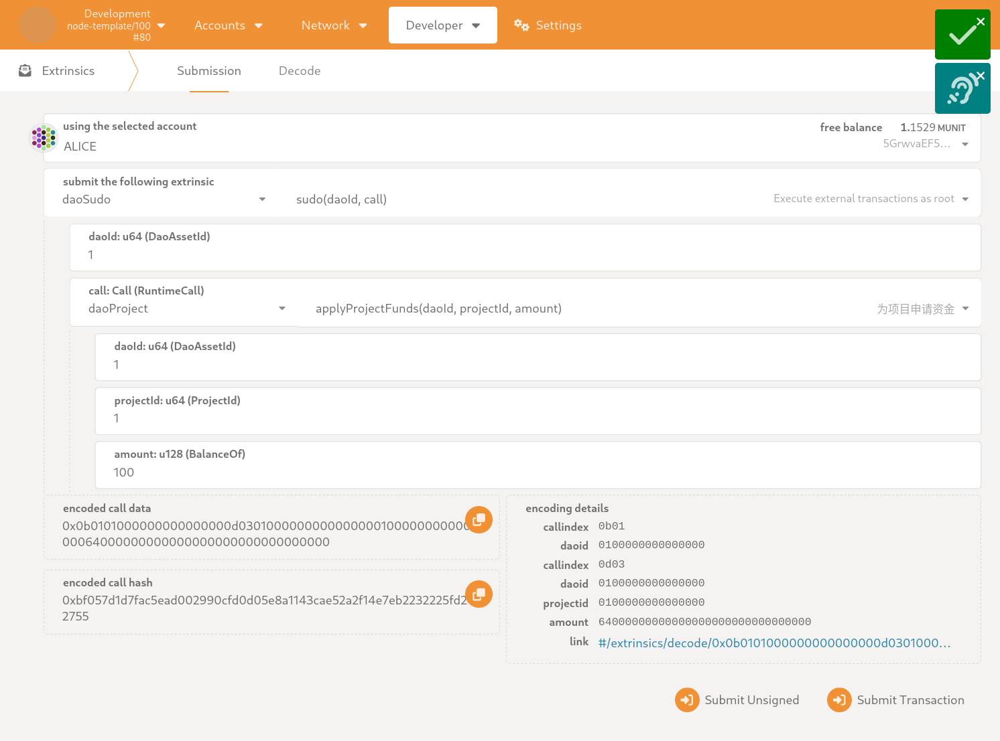

## Create project task 
- Open Developer --> Extrinsics section
- From the list of available extrinsics select daoProject --> createTask 
- input dao id 1
- input project id 1
- input name and desc and point priority
- Submit Transaction --> project task successfully created

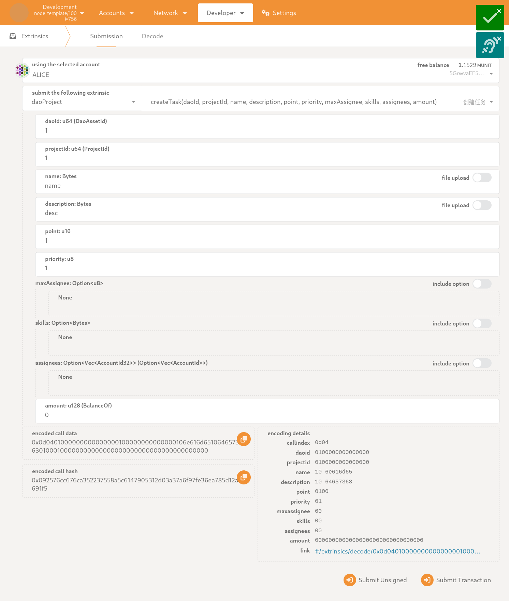

## join project task as assignee
> sudo must called by Alice
- Open Developer --> Extrinsics section
- From the list of available extrinsics select daoProject --> joinTask 
- input dao id 1
- input project id 1
- input task id 1
- Submit Transaction --> successfully

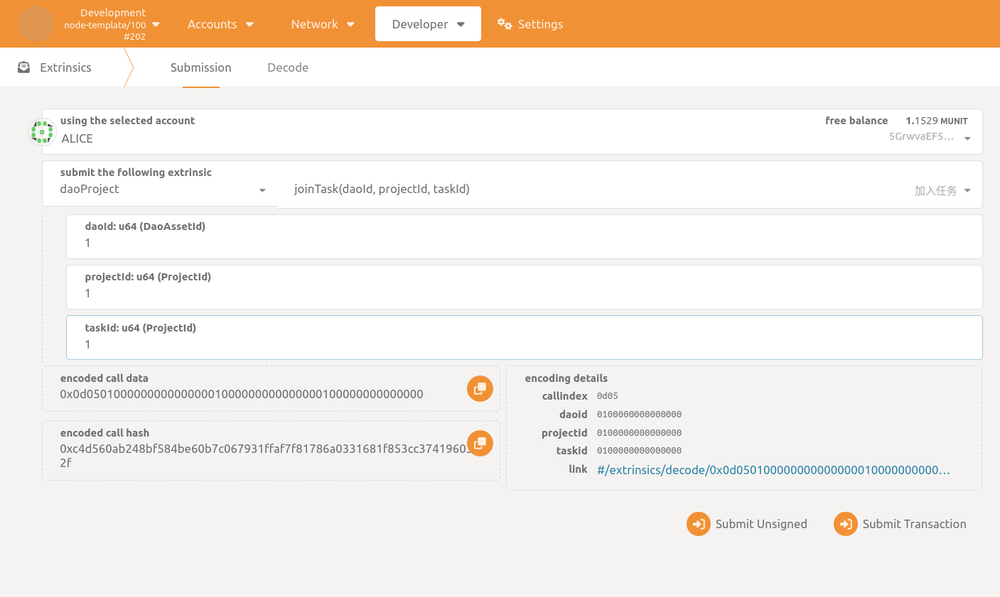

## new user join project with sudo (task reviewer must be other user)
> sudo must called by ALICE
- Open Developer --> Extrinsics section
- From the list of available extrinsics select daoSudo --> sudo callable 
- input dao id 1
- From the list of available proposal: Call (RuntimeCall) select daoProject --> projectJoinRequest callable 
- input dao id 1
- input project id 1
- select new user BOB
- Submit Transaction --> successfully
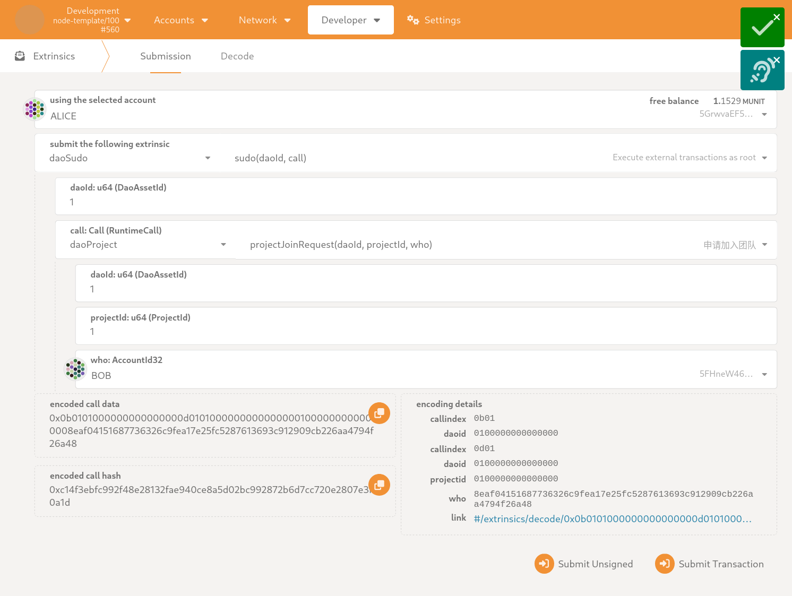

## join project task as reviewer
> sudo must called by BOB
- Open Developer --> Extrinsics section
- From the list of available extrinsics select daoProject --> beTaskReview 
- input dao id 1
- input project id 1
- input task id 1
- Submit Transaction --> successfully

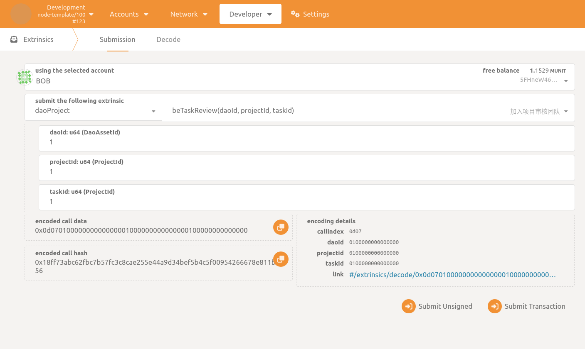

## Start project task 
> sudo must called by Alice
- Open Developer --> Extrinsics section
- From the list of available extrinsics select daoProject --> startTask 
- input dao id 1
- input project id 1
- input task id 1
- Submit Transaction --> project task successfully start

## Project task requset review
> sudo must called by Alice
- Open Developer --> Extrinsics section
- From the list of available extrinsics select daoProject --> requsetReview 
- input dao id 1
- input project id 1
- input task id 1
- Submit Transaction --> requset for reviewer to review

## Reviewer make task review
> sudo must called by BOB
- Open Developer --> Extrinsics section
- From the list of available extrinsics select daoProject --> requsetReview 
- input dao id 1
- input project id 1
- input task id 1
- WeteeProjectReviewOpinion option select YES
- Submit Transaction --> make task review successfully

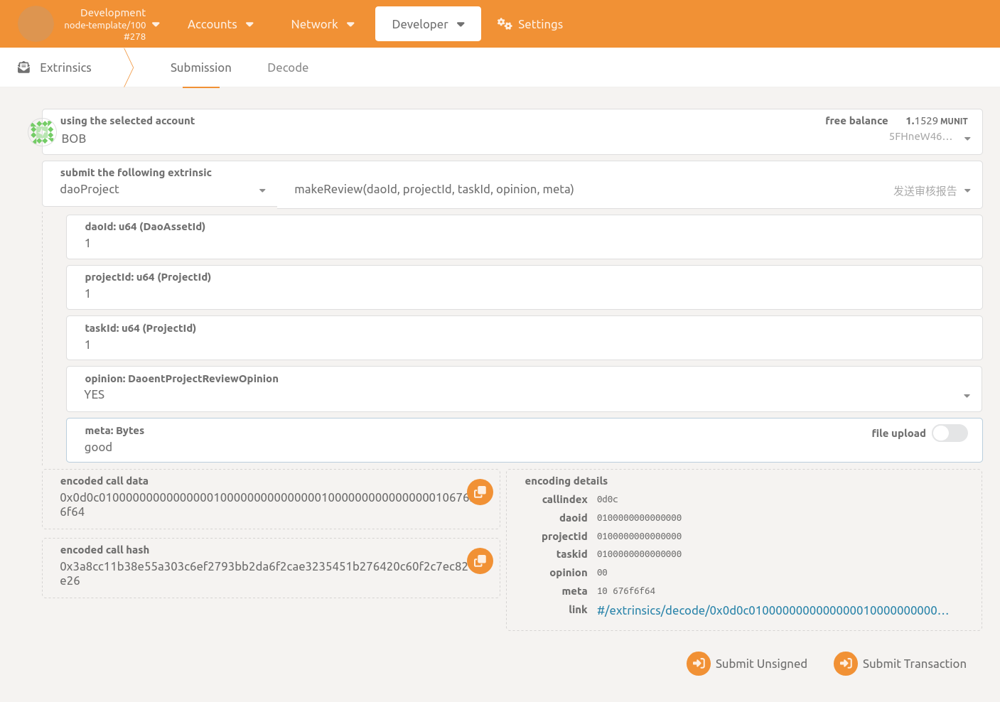

## Project task done
> sudo must called by Alice
- Open Developer --> Extrinsics section
- From the list of available extrinsics select daoProject --> requsetReview 
- input dao id 1
- input project id 1
- input task id 1
- Submit Transaction --> rtask done

